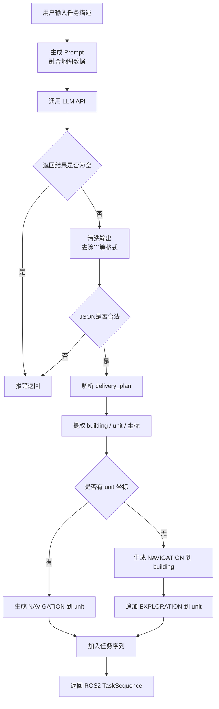
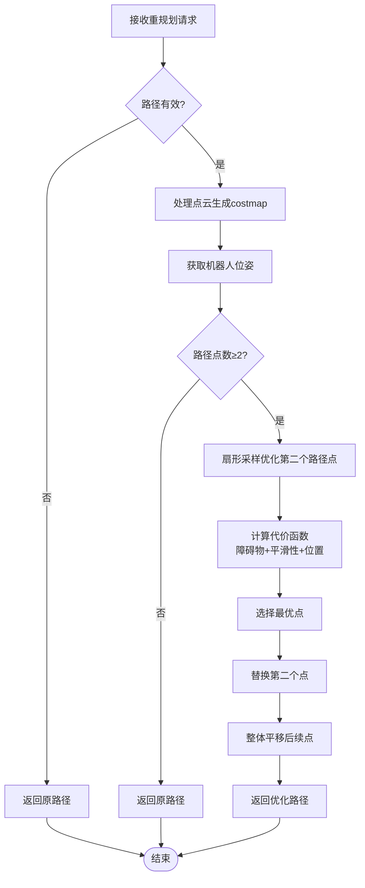
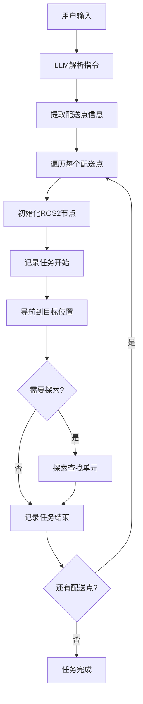
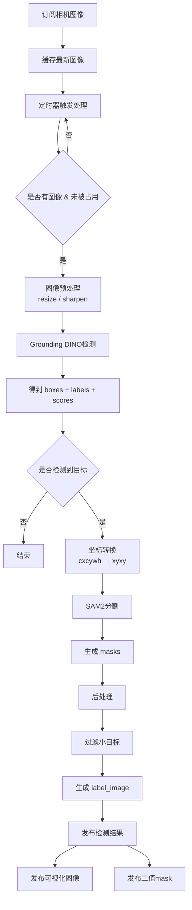
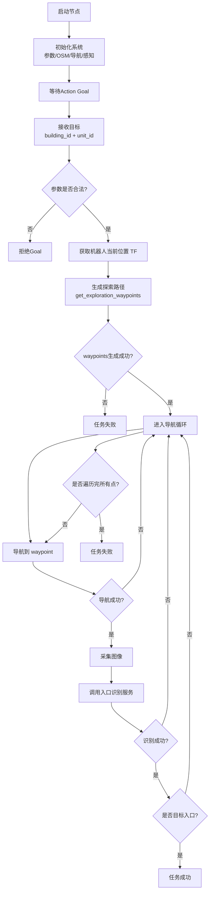
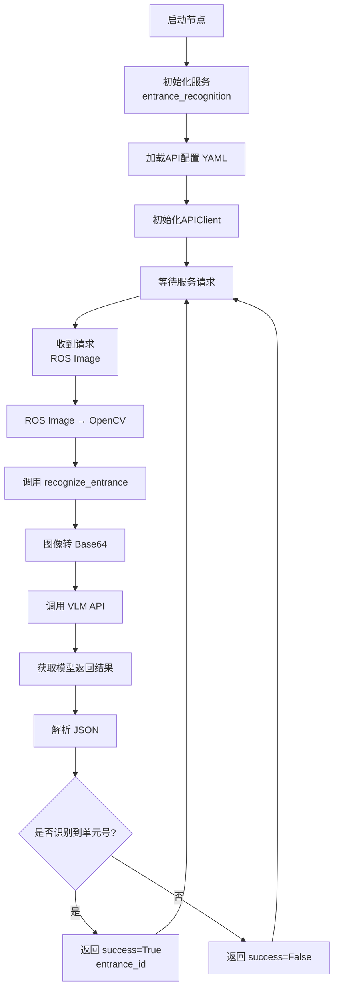
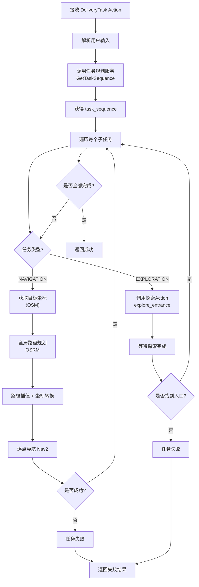
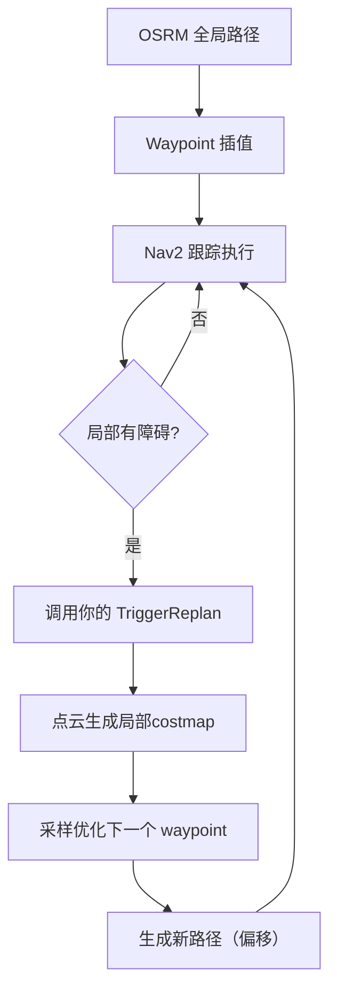

# ***1. src/utils_pkg***
`工具箱`（提供工具 —— 地图解析、坐标转换、API 调用）
- `OSRM` 的作用是提供高效、道路级别的路径规划和路网分析服务
- [medium.osm](src/utils_pkg/resource/osm/medium.osm)

# ***2. src/task_planning***
`语义导航`
- 简而言之：这是一个“翻译官”节点，它听懂人话，查地图，然后告诉机器人：“先去哪，再去哪，如果找不到具体门牌号就先到大楼门口再慢慢找”
- `LLM` —— [ api_config.yaml](src/task_planning/config/api_config.yaml)
- [task_planning_sim.yaml](src/task_planning/config/task_planning_sim.yaml)
- [task_planning_server.py](src/task_planning/task_planning/task_planning_server.py)

# ***3. src/replanner***
核心功能：当机器人遇到障碍物时，动态优化局部路径，生成绕过障碍物的平滑路径
- `不重新规划整条路径，只优化“第二个点”`
- [waypoint_replanner.yaml](src/replanner/config/waypoint_replanner.yaml)
- [waypoint_replanner_server.py](src/replanner/replanner/waypoint_replanner_server.py)

# ***4. src/llm_delivery***
估计是用来验证不同 LLM-API 的任务理解能力
- [llm_delivery_node.py](src/llm_delivery/llm_delivery/llm_delivery_node.py)

# ***5. src/grounded_sam2***
该模块基于 `Grounding DINO + SAM2`，实现`开放词汇目标检测`与`实例分割`，支持通过文本动态指定检测类别，并输出`像素级语义信息`，用于下游导航与环境理解

- [gsam2_params.yaml](src/grounded_sam2/config/gsam2_params.yaml)
- [gsam2_node.py](src/grounded_sam2/grounded_sam2/grounded_sam2/gsam2_node.py)

| 类型     | 说明           |
| ------: | ------------ |
| 分类     | 整张图一个标签      |
| 检测     | 框            |
| 语义分割   | 每像素类别（不区分个体） |
| 实例分割 | 每个物体 + 每像素   |

# ***6. src/entrance_exploration***
`探索任务`
- [entrance_exploration_params_sim.yaml](src/entrance_exploration/config/entrance_exploration_params_sim.yaml)
- [entrance_exploration_action_server.py](src/entrance_exploration/entrance_exploration/entrance_exploration_action_server.py)

# ***7. src/building_entrance_recognition***
这是一个基于`视觉大模型（VLM）的入口识别服务`，通过将图像编码后输入模型，解析结构化JSON结果，实现单元门编号识别，并与导航模块形成闭环
- `VLM` —— [api_config.yaml](src/building_entrance_recognition/config/api_config.yaml)
- [entrance_recognition_server.py](src/building_entrance_recognition/building_entrance_recognition/entrance_recognition_server.py)

# ***8. src/delivery_executor***
任务状态机与业务逻辑执行
- [delivery_executor_sim.yaml](src/delivery_executor/config/delivery_executor_sim.yaml)
- [delivery_executor_action_server.py](src/delivery_executor/delivery_executor/delivery_executor_action_server.py)

# ***9. src/delivery_bringup***
本系统采用分层规划架构，上层`基于OSRM进行全局路径规划`，下层`结合实时感知信息进行局部路径优化`，通过触发式replanning机制提升系统在动态环境中的鲁棒性。
- [delivery_bringup_sim.yaml](src/delivery_bringup/config/delivery_bringup_sim.yaml)
- src/delivery_bringup/launch/delivery_system_sim.launch.py

| 层级           | 谁在做               | 作用          |
| ------------ | ----------------- | ----------- |
| 🌍 全局规划      | OSRM              | 超远距离路径      |
| 🧠 局部规划（你写的） | WaypointReplanner | 避障 + 调整路径   |
| 🤖 控制执行      | Nav2              | 跟踪 waypoint |

# ***10. src/delivery_benchmark***
“考试系统”

# ***11. src/custom_interfaces***
标准化通信的“语言字典”

# ***12. src/classic_perception***
增加了 `ipm` : 把摄像头的“透视眼”变成“俯视眼” —— `好像没有使用`

